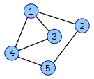
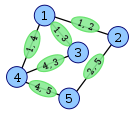
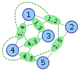
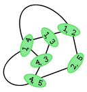
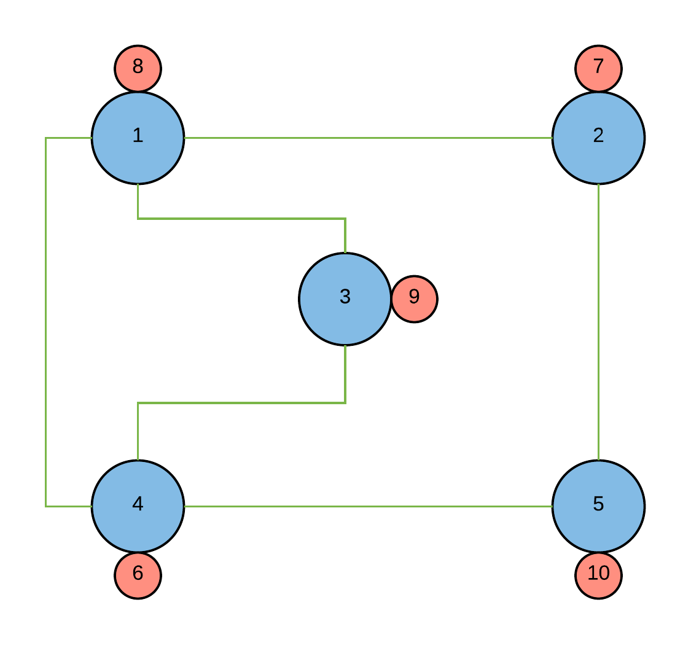
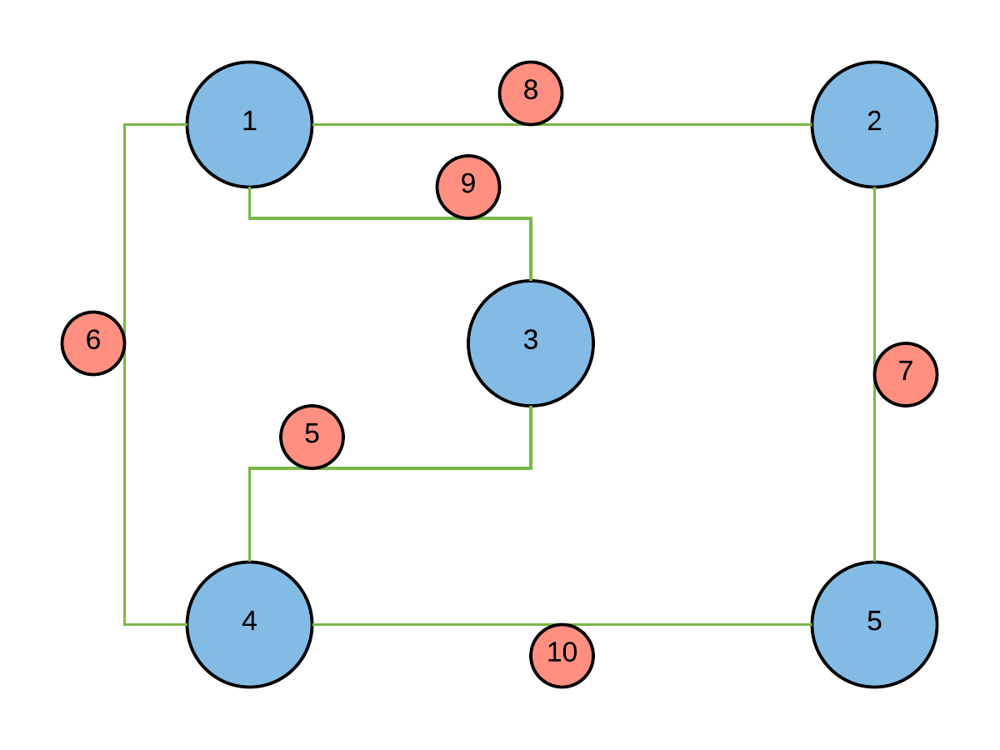

# Sample-Code

## What is this repository?

This repository is used to demonstrate the transformation of a graph into its corresponding Line Graph.

## How to run the code on the computer?

Make sure you have gcc/g++ installed.
Download the code or Clone the repository and compile it.

```
g++ -std=c++11 Line-Graph/line.cpp -o lineGraph
```

Then, run it and save the output to a file.

```
./lineGraph > output.txt
```


### Sample Input

The sample input has the following **nodes**:-

1. Node **_1_** has cost **_8_**.

2. Node **_2_** has cost **_7_**.

3. Node **_3_** has cost **_9_**.

4. Node **_4_** has cost **_6_**.

5. Node **_5_** has cost **_10_**.


The **edges** in the sample input are :-

1. Node **1** and **2** are connected by an edge having cost **_8_**.

2. Node **1** and **3** are connected by an edge having cost **_9_**.

3. Node **1** and **4** are connected by an edge having cost **_6_**.

4. Node **2** and **5** are connected by an edge having cost **_7_**.

5. Node **3** and **4** are connected by an edge having cost **_5_**.

6. Node **4** and **5** are connected by an edge having cost **_10_**.

The above sample input produces the following [output](Line-Graph/output.txt).

## What is a [Line Graph](https://en.wikipedia.org/wiki/Line_graph)?

Given a graph `G`, its line graph `L(G)` is a graph such that:-

- each vertex of `L(G)` represents an edge of `G`.

- two vertices of `L(G)` are adjacent if and only if their corresponding edges share a common endpoint in `G`.

The following figures show a graph (left, with blue vertices) and its line graph (right, with green vertices).

   

## Handling of Costs

* **Cost associated with the nodes**
    * Consider the following graph with nodes having costs:-
        
        The above graph is taken from the [sample data](https://github.com/vidhan13j07/Sample-Code#sample-input)

        The transformed **Line Graph**:-
        

        Each node of the transformed graph is an edge from the original graph. Here `[1,2]` denotes the node in the transformed graph which was an edge from **node `1`** to **node `2`** in the original graph.

        Each edge of the transformed graph is a **tuple** of nodes `(n1, n2, n3)` where `n1`, `n2` and `n3` are nodes from the original graph such that there was an edge from `n1 -> n2` and another edge from `n2 -> n3`.

        Thus, the connection `[1,4] -> [3, 4]` goes through the vertex `4` as it is made up of `(1, 4, 3)` **tuple** which has an associated cost of `6` therefore the corresponding edge in the above graph gets a cost of `6`.

* **Cost associated with the edges**
    * Consider the following graph with edges having costs:-
        
        The above graph is taken from the [sample data](https://github.com/vidhan13j07/Sample-Code#sample-input)

        The transformed **Line Graph**:-
        

        Here, the cost associated with an edge in the original graph moves to the corresponding nodes in the transformed Line Graph.
